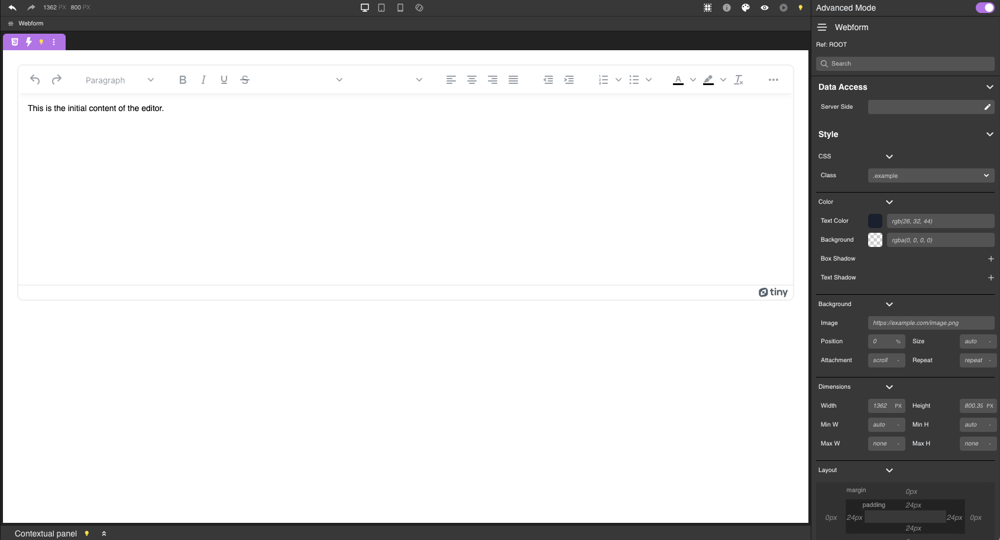

# Overview

Integrate TinyMCE into your Qodly Project seamlessly with our custom TinyMCE Component.

### Prerequisites:

- TinyMCE API Key : Obtain a TinyMCE API Key by registering on the [TinyMCE website](https://www.tiny.cloud/).

# Getting Started

The TinyMCE Component allows you to embed a powerful text editor into your Qodly Project. Ensure you have your TinyMCE API Key before proceeding.

| Name                 | Type    | Default | Description                                                                                              |
| -------------------- | ------- | ------- | -------------------------------------------------------------------------------------------------------- |
| `DataSource`         | String  |         | The data source containing the content to be displayed.                                                  |
| `APIKey`             | String  |         | Your API Key for initializing TinyMCE.                                                                   |
| `Toolbar Location`   | String  | `top`   | Defines the position of the toolbar. Possible values: `top`, `bottom`, `auto`. Default: `top`.           |
| `Resize`             | Boolean | `false` | If set to `true`, the editor size adjusts dynamically based on content.                                  |
| `MenuBar`            | Boolean | `false` | If set to `true`, a menu bar with additional options will be available.                                  |
| `Inline`             | Boolean | `false` | If set to `true`, activates inline mode, removing the toolbar (not supported on mobile devices).         |
| `ReadOnly`           | Boolean | `false` | If set to `true`, the text inside the editor becomes uneditable.                                         |
| `Browser SpellCheck` | Boolean | `false` | If set to `true`, uses the browser’s native spell check functionality.                                   |
| `Status Bar`         | Boolean | `false` | If set to `true`, a small status bar appears at the bottom of the editor.                                |
| `Lite Version`       | Boolean | `false` | If set to `true`, enables a lite version of the toolbar.                                                 |
| `Dark Mode`          | Boolean | `false` | If set to `true`, activates dark mode for the editor.                                                    |
| `Add Button`         | Boolean | `false` | If set to `true`, adds a button that can be bound to an `onclick` event. (Works only with Lite Version.) |

Customize your TinyMCE experience with these versatile options. Explore the rich features TinyMCE offers for creating and editing text effortlessly.

## TODO

- Finish "Add Button" functionality.
